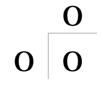
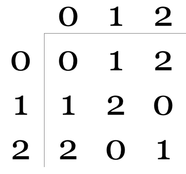
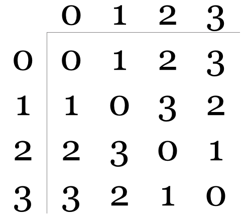

Lecture 8
---------

*Lecture: Tue 11th February 2014  -  Today: Tue 18th February 2014*

### Lorenz Cipher

-   The traffic intecepted was refered to as "Fish"
    -   It sounded like the bubbling of fishes
-   The machinary was nicknamed "Tunny"
-   German high command teleprinter cipher
-   Didn't see the machines before they broke iti
-   Encrypted each 5 bit word XOR with pseudorandom numbers
-   Ideally you would use a one time pad with truly random numbers
-   But there is a huge problem with key distribution here
-   Mechanical contraption generated pseudorandom numbers
-   Used prime numbers of cogs
-   Rotated in fancy ways
-   **THERE WAS A TERRIBLE COCK UP!**
-   As often seen, ciphers can be broken by poor operator practice
-   There was a message that wasn't received correctly
    -   So they retransmitted it with the corrections -- using the same
        key!
-   XOR'd the two messaged together to get PT1 XOR PT2
-   It was possible to find the PTs then find the key
-   They were actually able to reconstruct the whole machine using the
    key

### Venona decrypts

- Manual one time pad
- Typed out on paper and XOR'd by hand
- Used codewords, unless stated otherwise
    -   The fact that it had these two mode actually made it easier to
        decode
- Bad operator practice lead to one time pads being reused
- The breaking of this code relied on a very high capture
- Which were then cross checked
- If you capture everything, maybe you will find where someone screwed up
- The information gleaned from Venona was useful for years
- Roundup Russian spies and kill 'em

### Steganography

-   Hiding the presence of any message at all
-   Some JPEGs and some tools
-   Turns out you can concatenate a JPEG to the end of another JPEG
    -   and you won't be able to see it
-   There was some data hidden in the metadata
-   Encrypted with something similar to RC4
    -   RC4 is both broken and widely used

And now for some maths! 
-----------------------

Groups
------

-   Consists of a set, and a binary operation
-   Binary operation takes two elements of the set, and returns another
    element of the set
-   Basic example:
    -   The integers under addition: 7 + 9 = 16
    -   Numbers are elements, addition is the operator
-   Groups are symmetries
-   They originate in operations we can perform on things, for example
    rotating some paper
-   There is a well defined order
-   We throw away the things they act upon
-   We can now focus on what the operators do
-   And how they relate to one another
-   Category theory looks at the relationships while throwing away the
    sets
-   You can think about the integers as being operators on bananas
    -   3 bananas + 2 bananas - 4 bananas: Makes sense

#### The rules

-   There must be an identity e
    -   ∀ s | es = se = s
    -   For integers under addition this is 0
-   There must be an inverse s-1
    -   s op s-1 = e
    -   s = 3; s-1 = -3
-   Associativity
    -   The magic that captures in the abstract group, the fact that
        this comes from acting on things
    -   (a op b) op c = a op (b op c)

#### An example

>   0    **e**   **a**   **b**  
> **e**  e       a       b  
> **a**  a       b       e  
> **b**  b       e       a  

- Can't have the same thing in two rows:
    -   a e = a AND a b = a
    -   So we can't have an inverse - we have forgotten where we came from
    -   a-1 a e = e AND a-1 a b = b
    -   but a e and a b are both a
- It's a Latin square
-   You don't know for sure that it is a group
    -   You know there can be inverses, but you don't know that there are
- You also don't know that it is associative
- But this is the same:

>  **+**   **0**   **1**   **2**  
>  **0**   0       1       2  
>  **1**   1       2       0  
>  **2**   2       0       1  

- And that there is just addition modulo 3
- Modular addition always gets you a group :)
    -   To understand why, you must be careful

- We know integers under addition form a group
    -   Pick 0, 1, 2 as representatives of the integers
    -   All integers of form 3n
        -   3n, 3n + 1, 3n + 2
        -   If we do addition on any two elements of these three sets
        -   our answer will be in one of the sets
    -   e.g. (3n + 1) + (3n + 2) = (3n)

- A classic way to make a group is to take something that we know has the
desired properties, and then restricting the size

- Associativity is a nightmare!
    -   Just start with something you know is associative, and throw some
        away
- Latin square just guarantees that everything COULD have an inverse
    -   But doesn't guarantee it
    -   When making a latin square you could throw away inverses to make it
        look right...

#### A very small group

- A perfectly good group
    -   Got a set and an operation, is associative, has identity and inverse
- Actually a useful group for error correcting codes
- This is the group of binary multiplication

#### A slightly bigger group

- Addition modulo 2 
- Perfectly good group
- You can check associativity by hand if you really want to 
    - But you already know it's associative because its modulo 2 arithmetic 
    - And we have a nice proof for that 

#### A bigger group 

- Not all filled in? 
- Could it be x,y or z? 
    - It's like a sudoku -- but easier
- Any old latin square of size 2 or 3 is a group... 

#### Bigger still 

- Modulo 4 addition 
- Once again, it's fine 
- Notice that 1 + 1 is not 0 1 + 1 + 1 + 1 = 0 
- Can we make a latin square with 0s on the diagonal? 
    - Yes, but it must be structurally different from the one above
    - There is no way of relabeling it to get back to it 
    - Each element by itself gives you the identity, which wasn't true before 
- To check associativity 
    - Write it as vectors 0 is (0, 0) 1 is (1, 0) 2 is (0, 1) 3 is (1, 1) 
    - Then we do addition mod 2 component by component If you think
      of it that way it is instantly obvious that is is associative 
- We have just paired up two copies 
- There are two groups that are distinct: 
    - In one: 1 + 1 = 0 
    - In the other 1 + 1 + 1 + 1 = 0 

#### Quick recap 
    
- Group G: Set s ∈ S WITH Operation o 
- MUST HAVE 
    - Identity e 
    - Inverse s-1 
    - Associativity 
    - Do not in general require commutativity 
        - But the ones that we care about do tend to be
